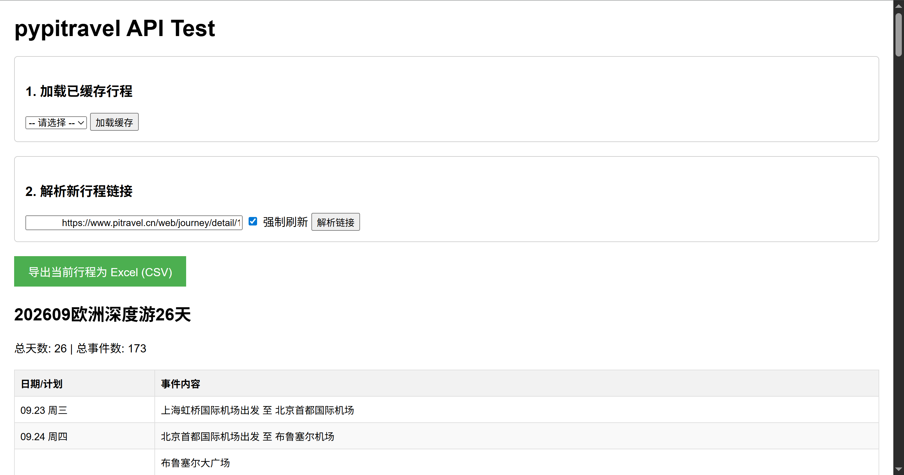

# PyPitravel

PyPitravel 是一个用于解析旅行规划平台《圆周旅迹》数据、提供行程规划导出与可视化的工具。

## 项目由来
由于“圆周旅迹”仅提供 iOS 客户端，导致在电脑端进行复杂的行程规划与整理非常不便。本项目旨在通过解析其 API 数据，在电脑端实现行程的可视化导出与整理。

## 核心功能

*   **智能解析**: 自动从旅行行程链接中提取行程 ID。
*   **API 代理**: 安全地获取旅行规划平台数据，绕过 CORS 跨域拦截。
*   **本地部署**: 提供轻量级的本地 Web 服务。
*   **可视化分析**: 支持交互式地图轨迹绘制与行程数据分析（开发中）。
*   **便携运行**: 基于 Nuitka 打包，用户无需安装 Python 环境即可使用。

## 快速上手

### 环境要求
*   Python >= 3.12
*   [uv](https://github.com/astral-sh/uv) (推荐用于依赖管理)

### 开发运行
1.  同步依赖:
    ```bash
    uv sync
    ```
2.  启动应用:
    ```bash
    uv run pypitravel
    ```
3.  访问浏览器:
    打开 `http://127.0.0.1:8000` 即可开始使用。

## CLI 安装
你可以将本项目安装到本地环境以便直接调用：
```bash
uv pip install -e .
pypitravel
```

## 应用预览



## 技术栈
*   **后端**: FastAPI, httpx
*   **前端**: HTML, JavaScript (Leaflet.js 规划中)
*   **打包**: Nuitka
*   **依赖管理**: uv

## 许可证

本项目采用 [Apache License 2.0](LICENSE) 开源。

## 免责声明

PyPitravel 仅供个人学习与研究使用。所调用的 Pitravel 服务为商业软件，其 API 和数据归原平台所有。
*   本项目不承担任何因使用本项目而导致的平台服务条款违反责任。
*   严禁将本项目用于任何商业用途或大规模自动化抓取。
*   使用时请遵守目标平台的相关服务条款与隐私政策。
