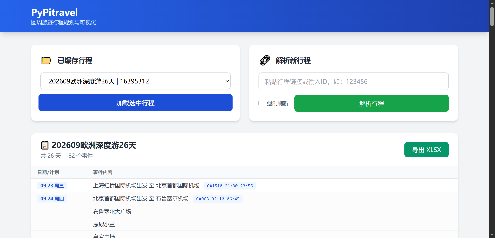
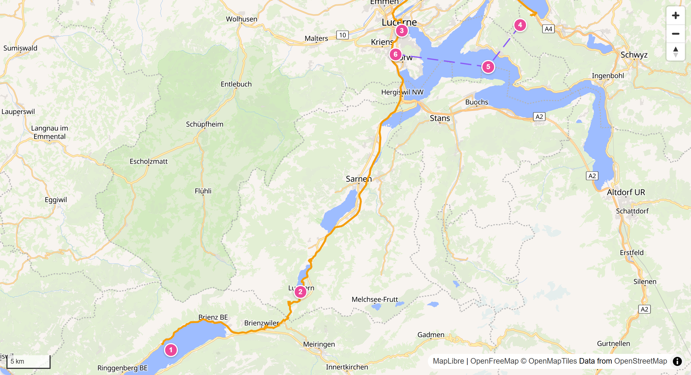

# PyPitravel

[](https://pypi.org/project/pypitravel/)
[](https://www.python.org/downloads/)
[](LICENSE)

PyPitravel 是一个用于解析旅行规划平台《圆周旅迹》数据、提供行程规划导出与可视化的工具。

## 项目由来
由于“圆周旅迹”仅提供 iOS 客户端，导致在电脑端进行复杂的行程规划与整理非常不便。本项目旨在通过解析其 API 数据，在电脑端实现行程的可视化导出与整理。

## 核心功能

*   **智能解析**: 自动从旅行行程链接中提取行程 ID，并支持航班交通信息的精简备注。
*   **API 代理**: 安全地获取旅行规划平台数据，绕过 CORS 跨域拦截。
*   **本地部署**: 提供轻量级的本地 Web 服务。
*   **可视化分析**: 支持交互式地图轨迹绘制，区分飞机/火车/驾车/步行路线，支持日期筛选。
*   **数据导出**: 支持将行程规划数据导出为 **XLSX** 格式，方便在 Excel 中进行编辑与打印。
*   **便携运行**: 基于 Nuitka 打包，用户无需安装 Python 环境即可使用。

## 快速上手

### 安装
使用 pip 安装：
```bash
pip install pypitravel
```

### 启动
安装完成后，在终端直接运行：
```bash
pypitravel
```
程序会自动寻找可用端口（默认 8000）并唤起浏览器，无需手动输入地址。

### 快速执行 (无需安装)
如果你安装了 `uv`，可以使用 `uvx` 直接运行，无需手动安装：
```bash
uvx pypitravel
```

## 从源码安装 (开发者)
如果你需要进行二次开发或修改源码：
1. 环境要求：Python >= 3.12，安装 [uv](https://github.com/astral-sh/uv)。
2. 克隆项目并安装依赖：
   ```bash
   uv sync
   ```
3. 运行项目：
   ```bash
   uv run pypitravel
   ```

## 应用预览

### 行程详情


### 路线地图


## 技术栈
*   **后端**: FastAPI, httpx
*   **前端**: HTML, JavaScript, Tailwind CSS, SheetJS, MapLibre GL JS
*   **地图**: MapLibre GL JS + OpenFreeMap + OSRM 路由
*   **打包**: Nuitka
*   **依赖管理**: uv

## 许可证

本项目采用 [Apache License 2.0](LICENSE) 开源。

## 免责声明

PyPitravel 仅供个人学习与研究使用。所调用的 Pitravel 服务为商业软件，其 API 和数据归原平台所有。
*   本项目不承担任何因使用本项目而导致的平台服务条款违反责任。
*   严禁将本项目用于任何商业用途或大规模自动化抓取。
*   使用时请遵守目标平台的相关服务条款与隐私政策。
